# CODEx Write - Quick Start Guide

## 🚀 5-Minute Setup

### Step 1: Setup PAT (One-time)
```powershell
.\setup-codex-pat.ps1
```

This will:
- ✅ Check GitHub CLI installation
- ✅ Authenticate with GitHub
- ✅ Guide you to create a Personal Access Token
- ✅ Add CODEX_PAT secret to your repository

### Step 2: Run the Workflow
```powershell
.\run-codex-write.ps1
```

That's it! 🎉

---

## 📋 What You Get

### Files Created
- `.github/workflows/codex-write.yml` - Main workflow file
- `run-codex-write.ps1` - Helper script to trigger workflow
- `setup-codex-pat.ps1` - Setup wizard for PAT
- `CODEX_WRITE_GUIDE.md` - Complete documentation
- `docs/architecture/adham-agritech-vision.md` - Auto-updated vision document

### Features
- ✅ Automated documentation updates
- ✅ Safe Git operations with PAT
- ✅ Multiple update types (vision, architecture, documentation)
- ✅ Validation before committing
- ✅ Prevents infinite workflow loops
- ✅ Detailed execution summaries

---

## 🎯 Common Commands

### Trigger Workflow
```powershell
# Default (vision update)
.\run-codex-write.ps1

# Architecture update
.\run-codex-write.ps1 -UpdateType architecture

# Wait for completion
.\run-codex-write.ps1 -Wait

# Don't open browser
.\run-codex-write.ps1 -NoBrowser
```

### Using GitHub CLI
```bash
# Trigger workflow
gh workflow run codex-write.yml -f update_type=vision

# List runs
gh run list --workflow=codex-write.yml

# View latest run
gh run view

# Watch running workflow
gh run watch
```

### Check Results
```bash
# Pull changes
git pull

# View updated file
cat docs/architecture/adham-agritech-vision.md

# View commit history
git log --author="codex-bot" --oneline -5
```

---

## 🔧 Troubleshooting

### "Permission denied"
```powershell
# Check if secret exists
gh secret list

# If missing, run setup again
.\setup-codex-pat.ps1
```

### "Workflow not found"
```bash
# List all workflows
gh workflow list

# Enable workflow if disabled
gh workflow enable codex-write.yml
```

### "No changes to commit"
This is normal - the workflow only commits if there are actual changes.

---

## 📚 Learn More

- **Complete Guide:** `CODEX_WRITE_GUIDE.md`
- **Command Reference:** `CODEX_COMMANDS.md`
- **Integration Guide:** `CODEX_INTEGRATION_GUIDE.md`

---

## 🎓 How It Works

```mermaid
graph LR
    A[Trigger Workflow] --> B[Checkout Code]
    B --> C[Configure Git with PAT]
    C --> D[Update Documents]
    D --> E[Validate Changes]
    E --> F{Changes?}
    F -->|Yes| G[Commit & Push]
    F -->|No| H[Skip]
    G --> I[Done ✓]
    H --> I
```



1. **Trigger:** You run the workflow manually or via script
2. **Authenticate:** Uses CODEX_PAT for Git operations
3. **Update:** Generates/updates documentation files
4. **Validate:** Checks files exist and are valid
5. **Commit:** Commits changes with `[skip ci]` tag
6. **Push:** Pushes directly to main branch

---

## 🔐 Security Notes

- ✅ PAT is stored as GitHub secret (encrypted)
- ✅ Never exposed in logs or commits
- ✅ Uses `users.noreply.github.com` email
- ✅ `[skip ci]` prevents infinite loops
- ✅ Validates changes before committing

---

## 💡 Pro Tips

1. **Set PAT expiration to 90 days** - Balance between security and convenience
2. **Use `-Wait` flag** - When you need to see results immediately
3. **Check workflow logs** - If something goes wrong, logs have details
4. **Pull before editing** - Always pull latest changes before manual edits
5. **Use branches for experiments** - Modify workflow in a branch first

---

## 🆘 Need Help?

1. Check workflow logs: `gh run view --log`
2. Review guide: `CODEX_WRITE_GUIDE.md`
3. Check secrets: `gh secret list`
4. Verify workflow: `gh workflow view codex-write.yml`
5. Open an issue on GitHub

---

**Ready to automate your documentation? Run `.\setup-codex-pat.ps1` now!** 🚀
