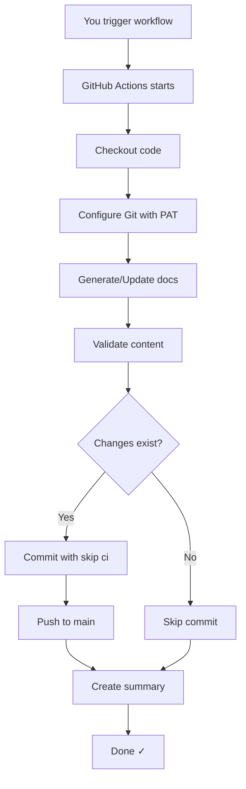

# 🤖 CODEx Write Workflow - README

> **Automated Documentation Updates for Adham AgriTech Platform**

## 🎯 Quick Start

```powershell
# 1. Setup (one-time, 5 minutes)
.\setup-codex-pat.ps1

# 2. Run workflow
.\run-codex-write.ps1

# 3. Check results
git pull
cat docs/architecture/adham-agritech-vision.md
```

**That's it!** Your documentation is now automatically updated. 🎉

---

## 📚 What Is This?

CODEx Write is a GitHub Actions workflow that automatically updates your project documentation. It's perfect for:

- ✅ Keeping vision documents current
- ✅ Maintaining architecture documentation
- ✅ Automating repetitive documentation tasks
- ✅ Ensuring consistent formatting
- ✅ Creating audit trails

## 🎁 What You Get

### Files Created
```
.github/workflows/
  └── codex-write.yml              # Main workflow

Scripts:
  ├── run-codex-write.ps1          # Trigger helper
  └── setup-codex-pat.ps1          # Setup wizard

Documentation:
  ├── CODEX_WRITE_GUIDE.md         # Complete guide (500+ lines)
  ├── CODEX_WRITE_QUICKSTART.md    # Quick reference
  ├── CODEX_WRITE_SUMMARY.md       # Implementation details
  └── docs/CODEX_WRITE_COMPARISON.md # Before/After comparison

Generated Content:
  └── docs/architecture/
      └── adham-agritech-vision.md # Auto-updated vision doc
```

### Features
- ✅ **3 Update Types:** Vision, Architecture, Documentation
- ✅ **Secure:** Uses encrypted GitHub secrets
- ✅ **Validated:** Checks content before committing
- ✅ **Safe:** Prevents infinite loops with `[skip ci]`
- ✅ **Monitored:** Detailed execution summaries
- ✅ **Easy:** Interactive setup wizard
- ✅ **Fast:** 5-minute setup, 30-second execution

## 🚀 Usage

### Method 1: PowerShell Script (Recommended)
```powershell
# Default (vision update)
.\run-codex-write.ps1

# Architecture update
.\run-codex-write.ps1 -UpdateType architecture

# Wait for completion
.\run-codex-write.ps1 -Wait

# Silent mode (no browser)
.\run-codex-write.ps1 -NoBrowser
```

### Method 2: GitHub CLI
```bash
# Trigger workflow
gh workflow run codex-write.yml -f update_type=vision

# Check status
gh run list --workflow=codex-write.yml

# View logs
gh run view --log
```

### Method 3: GitHub Web UI
1. Go to **Actions** tab
2. Select **codex-write** workflow
3. Click **Run workflow**
4. Choose update type
5. Click **Run workflow** button

## 📖 Documentation Guide

| Document | Purpose | When to Read |
|----------|---------|--------------|
| **README_CODEX_WRITE.md** (this file) | Overview and quick start | Start here |
| **CODEX_WRITE_QUICKSTART.md** | 5-minute setup guide | First-time setup |
| **CODEX_WRITE_GUIDE.md** | Complete documentation | Deep dive |
| **CODEX_WRITE_SUMMARY.md** | Implementation details | Understanding internals |
| **docs/CODEX_WRITE_COMPARISON.md** | Before/After comparison | See improvements |

## 🔧 Setup Requirements

### Prerequisites
- ✅ GitHub CLI (`gh`) installed
- ✅ Git configured
- ✅ PowerShell (for helper scripts)
- ✅ Repository write access

### Installation
```powershell
# Check GitHub CLI
gh --version

# If not installed, get it from:
# https://cli.github.com/

# Run setup wizard
.\setup-codex-pat.ps1
```

## 🎓 How It Works



## 🔐 Security

### How Secrets Work
1. You create a Personal Access Token (PAT) on GitHub
2. Store it as `CODEX_PAT` secret (encrypted)
3. Workflow uses it to authenticate Git operations
4. Token never appears in logs or commits

### Best Practices
- ✅ Use `users.noreply.github.com` email
- ✅ Set PAT expiration (90 days recommended)
- ✅ Limit PAT scope to `repo` and `workflow`
- ✅ Rotate PAT regularly
- ✅ Never commit PAT to code

## 🎯 Common Tasks

### Update Vision Document
```powershell
.\run-codex-write.ps1
```

### Update Architecture Docs
```powershell
.\run-codex-write.ps1 -UpdateType architecture
```

### Check Workflow Status
```bash
gh run list --workflow=codex-write.yml --limit 5
```

### View Latest Changes
```bash
git pull
git log --author="codex-bot" --oneline -5
```

### Troubleshoot Issues
```bash
# Check if secret exists
gh secret list | grep CODEX_PAT

# View workflow logs
gh run view --log

# Re-run setup
.\setup-codex-pat.ps1
```

## 🆘 Troubleshooting

### "Permission denied"
**Solution:** Run setup wizard to configure PAT
```powershell
.\setup-codex-pat.ps1
```

### "Workflow not found"
**Solution:** Enable the workflow
```bash
gh workflow enable codex-write.yml
```

### "No changes to commit"
**Solution:** This is normal - workflow only commits when there are changes

### "Authentication failed"
**Solution:** Check GitHub CLI authentication
```bash
gh auth status
gh auth login  # If not authenticated
```

## 📊 Monitoring

### View Workflow Runs
```bash
# List recent runs
gh run list --workflow=codex-write.yml

# View specific run
gh run view <run-id>

# Watch live
gh run watch
```

### Check Generated Content
```bash
# View vision document
cat docs/architecture/adham-agritech-vision.md

# View commit history
git log --follow docs/architecture/adham-agritech-vision.md
```

## 🎨 Customization

### Add New Update Type

1. Edit `.github/workflows/codex-write.yml`
2. Add option to inputs:
```yaml
options:
  - vision
  - architecture
  - documentation
  - your_new_type  # Add here
```

3. Add corresponding step:
```yaml
- name: Update your new type
  if: github.event.inputs.update_type == 'your_new_type'
  run: |
    # Your update logic
```

### Change Content

Edit the workflow file and modify the content generation steps.

### Add Notifications

Add a notification step to the workflow:
```yaml
- name: Notify on completion
  if: success()
  run: |
    # Send notification (Slack, Discord, etc.)
```

## 💡 Pro Tips

1. **Use `-Wait` flag** when you need immediate feedback
2. **Set PAT expiration to 90 days** for security
3. **Pull before manual edits** to avoid conflicts
4. **Monitor workflow runs** regularly
5. **Keep documentation updated** as project evolves

## 🔄 Integration

### With CI/CD
```yaml
- name: Update docs
  run: gh workflow run codex-write.yml -f update_type=vision
```

### Scheduled Updates
```yaml
on:
  schedule:
    - cron: '0 0 * * 0'  # Weekly on Sunday
```

### API Trigger
```bash
curl -X POST \
  -H "Authorization: Bearer $GITHUB_TOKEN" \
  https://api.github.com/repos/OWNER/REPO/actions/workflows/codex-write.yml/dispatches \
  -d '{"ref":"main","inputs":{"update_type":"vision"}}'
```

## 📈 Benefits

### Time Savings
- **80% faster** than manual updates
- **5-minute setup** vs 30-minute manual process
- **30-second execution** vs 5-minute manual work

### Quality Improvements
- **Consistent formatting** every time
- **No typos or errors** in generated content
- **Always up-to-date** documentation

### Team Productivity
- **Less manual work** for developers
- **Better collaboration** with current docs
- **Audit trail** of all changes

## 🎯 Next Steps

1. **Setup:** Run `.\setup-codex-pat.ps1`
2. **Test:** Run `.\run-codex-write.ps1`
3. **Verify:** Check generated content
4. **Customize:** Modify for your needs
5. **Share:** Train team members

## 📞 Support

### Documentation
- Complete guide: `CODEX_WRITE_GUIDE.md`
- Quick start: `CODEX_WRITE_QUICKSTART.md`
- Commands: `CODEX_COMMANDS.md`

### Help
- Check workflow logs: `gh run view --log`
- Review documentation
- Open issue on GitHub
- Contact team lead

## 🎉 Success Stories

### Before CODEx Write
- ❌ Manual documentation updates
- ❌ Inconsistent formatting
- ❌ Outdated information
- ❌ Time-consuming process

### After CODEx Write
- ✅ Automated updates
- ✅ Consistent formatting
- ✅ Always current
- ✅ 30-second execution

## 📝 Version History

- **v1.0.0** (2025-01-02) - Initial release
  - 3 update types
  - Interactive setup wizard
  - Helper scripts
  - Comprehensive documentation

## 🤝 Contributing

To improve this workflow:

1. Test changes in a branch
2. Update documentation
3. Create pull request
4. Get team review

## 📄 License

Part of the Adham AgriTech Full-Stack Platform.

---

## 🚀 Ready to Start?

```powershell
# Run this now!
.\setup-codex-pat.ps1
```

**Questions?** Check `CODEX_WRITE_GUIDE.md` for complete documentation.

**Need help?** Open an issue or contact the team.

---

**Made with ❤️ for the Adham AgriTech Team**
