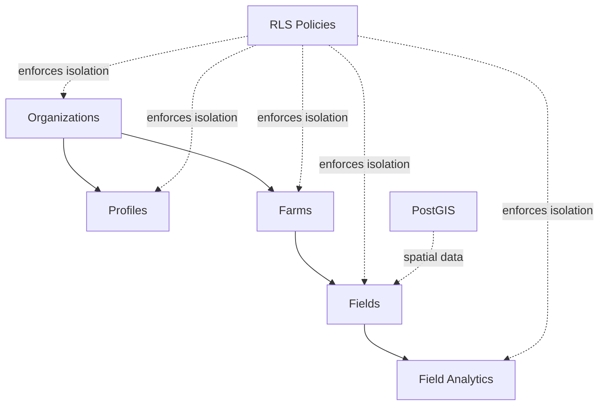

# Supabase Database Migrations

This directory contains database migrations for the Adham AgriTech Sentinel v2.0 platform.

## Migration Files

### Production-Ready Migrations

1. **[complete_schema_alignment.sql](migrations/complete_schema_alignment.sql)**
   - PostGIS extension enablement
   - Organizations table for multi-tenancy
   - Helper functions for RLS
   - Schema modifications (organization_id columns)
   - PostGIS geometry column for fields
   - Performance indexes (GIST, composite, FK)
   - Data migration (default org, lat/lng to geometry)
   - Comprehensive RLS policies
   - Verification and summary output

2. **[fix_security_warnings.sql](migrations/fix_security_warnings.sql)**
   - Function security fixes (search_path)
   - RLS on spatial_ref_sys
   - Optional PostGIS schema relocation

## Documentation

- **[MIGRATION_GUIDE.md](MIGRATION_GUIDE.md)** - Comprehensive migration guide
- **[QUICK_START.md](QUICK_START.md)** - Quick reference for applying migrations

## Quick Start

### Apply Migrations via Supabase Dashboard

1. Open https://app.supabase.com/project/vqawbzhtrcxojkgzvqit
2. Navigate to **SQL Editor**
3. Copy and execute `complete_schema_alignment.sql`
4. Copy and execute `fix_security_warnings.sql`
5. Verify success with queries in QUICK_START.md

### Verify Migration

```sql
-- Check migration was successful
SELECT COUNT(*) AS org_count FROM public.organizations;
SELECT COUNT(*) AS profiles_linked FROM public.profiles WHERE organization_id IS NOT NULL;
SELECT COUNT(*) AS farms_linked FROM public.farms WHERE organization_id IS NOT NULL;
SELECT COUNT(*) AS fields_with_geom FROM public.fields WHERE geom IS NOT NULL;
```

## What These Migrations Do

### Multi-Tenancy

- Creates `organizations` table
- Links `profiles` and `farms` to organizations
- Implements organization isolation via RLS

### Geospatial Support

- Enables PostGIS extension
- Adds `geom` column to `fields` table
- Creates spatial index (GIST) for performance
- Migrates lat/lng coordinates to geometry

### Security & Performance

- Row-Level Security (RLS) policies on all tables
- Function security fixes
- Performance indexes for common queries
- Automated timestamp updates

## Architecture



## Support

For detailed instructions, see:
- [MIGRATION_GUIDE.md](MIGRATION_GUIDE.md) for comprehensive documentation
- [QUICK_START.md](QUICK_START.md) for quick reference

## Safety

All migrations are:
- ✅ **Idempotent** - Safe to run multiple times
- ✅ **Non-destructive** - Add columns, don't drop data
- ✅ **Verified** - Include consistency checks
- ✅ **Reversible** - Rollback procedures documented
